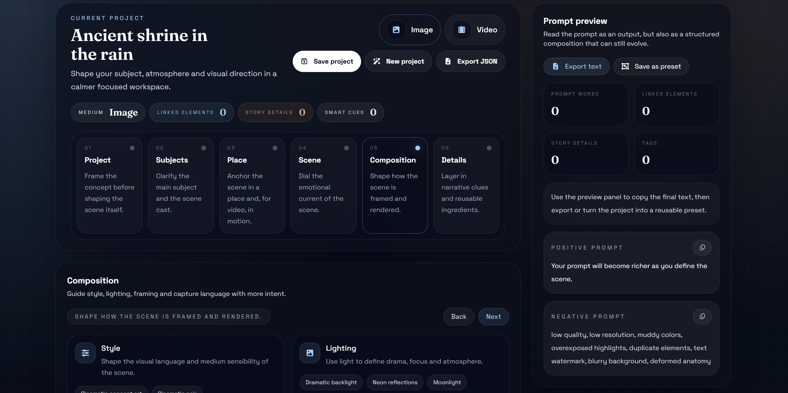
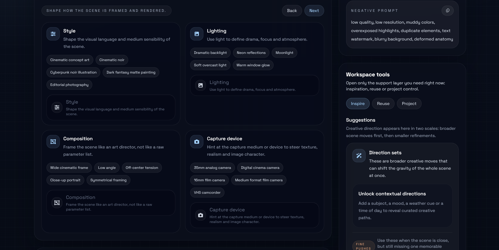

# Art Prompt Generator

[](https://github.com/valcriss/art-prompt-generator/actions/workflows/ci.yml)

Art Prompt Generator is a creative studio for building richer image and video prompts.

Instead of starting from a blank text box, the product helps artists, illustrators, designers and AI creators shape a scene through subject, environment, mood, lighting, composition, motion and storytelling detail. The goal is simple: turn a vague idea into a prompt that already feels directed, coherent and visually alive before generation even starts.



Main studio workspace with guided scene building, reusable creative tools and live prompt output.

## Why it exists

This is not a generic prompt textarea.

Art Prompt Generator is designed as a guided composition workflow where a prompt becomes the result of creative decisions made step by step. It is closer to a small art-direction studio than to a parameter form.

The current version is a frontend-first MVP built to validate one core question:

Can a more guided creative workflow help people write better prompts for image and video generation tools?

## What makes it different

- It treats a prompt as a creative project, not just a string of keywords
- It helps users shape atmosphere, framing, motion and storytelling, not only subject labels
- It supports both still-image prompting and single-shot video prompting in one workflow
- It keeps reusable creative ingredients close at hand through templates, history and a personal library
- It is bilingual from the start, with English and French UI support

## Features

- Build structured prompt projects for both image and video use cases
- Guide the scene through subject, place, mood, style, lighting, composition and story detail
- Generate positive and negative prompts from a richer creative structure
- Save prompt projects locally and reopen, duplicate or refine them later
- Reuse creative ingredients through a personal library of characters, locations, atmospheres and details
- Start faster with reusable templates and presets
- Work in English or French with localized UI from the start

## Who it is for

- AI artists
- digital illustrators
- concept artists
- graphic designers
- creative hobbyists
- anyone using tools such as ComfyUI who wants more expressive prompts

## Product direction

The product revolves around the idea of a prompt project rather than a single prompt string.

Each project captures a creative concept with structured scene information, reusable elements and live prompt output. Phase 1 stores everything locally in the browser through repository abstractions so the UX can be validated now without coupling the product to backend infrastructure too early.

## Current highlights

- guided prompt builder for image and single-shot video prompts
- contextual suggestions and richer guided vocabulary
- personal vocabulary for custom creative values across comboboxes
- reusable library and templates
- local project history with duplication and reopen flows
- export support and live prompt preview
- bilingual interface in English and French



## Roadmap direction

- deepen the creative workflow for prompt iteration and comparison
- continue improving mobile polish and responsive behavior
- introduce backend-backed sync and authentication in a later phase
- add richer reference-image and sharing capabilities when the core UX is validated

## Tech stack

- Vue 3
- TypeScript
- Vite
- Tailwind CSS
- Vue Router
- Vue I18n
- Vitest
- Vue Test Utils
- ESLint

## Getting started

### Run locally

```bash
npm install
npm run dev
```

Open the URL shown by Vite, usually `http://localhost:5173`.

### Main routes

- `/` landing page
- `/studio` prompt builder
- `/studio/library` reusable library management
- `/studio/templates` template management
- `/studio/history` saved projects

### Quality checks

```bash
npm run lint
npm run test
npm run build
```

The repository includes a GitHub Actions CI workflow that runs these checks automatically on each push and pull request, plus a Pages deployment workflow triggered by tags.

## Project structure

```text
src/
  components/        UI primitives
  composables/       shared studio state and orchestration
  domain/            prompt assembly and creative domain logic
  features/          landing, builder, templates, history, studio shell
  i18n/              locale setup and messages
  repositories/      local persistence abstractions
  types/             domain models
  utils/             small browser utilities
```

## Architecture notes

- Phase 1 is frontend-only and persists data locally
- UI components do not access `localStorage` directly
- persistence lives behind repository contracts
- the structure is intentionally ready for a later API-backed phase

Core repository abstractions include:

- `PromptProjectRepository`
- `PromptTemplateRepository`
- `LibraryElementRepository`
- `UserPreferenceRepository`

## Contributing

Issues, ideas and improvements are welcome.

If you want to contribute:

- open an issue for bugs, UX gaps or feature ideas
- create a branch from `main`
- run `npm run lint`, `npm run test` and `npm run build` before opening a pull request
- keep changes focused and consistent with the current product direction

## Project status

This repository is actively evolving as a frontend-first MVP. The current focus is product quality, creative workflow clarity and strong foundations for a later backend-backed phase.
